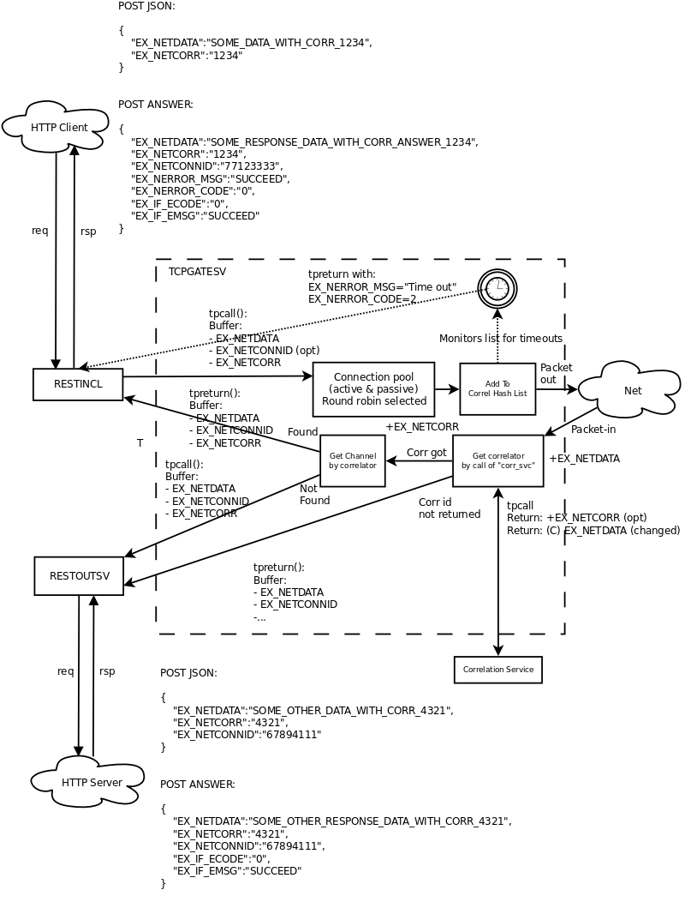

REST IN-OUT INTERFACE USER GUIDE
================================
Madars Vitolins
v1.0, 2017-09:
	Initial draft
:doctype: book

== Introduction
This document describes the typical Enduro/X REST usage. It will go through the
different use cases of the REST-IN and REST-OUT packages. The core functionality
is described in the man pages *restincl(8)* and *restoutsv(8)*. This doc will also
cover some functionality of the *tcpgatesv(8)*.

== Exposing TCP socket as REST service

In this setup, we will expose asynchronous TCP socket over the REST service. So
client will send data encoded in UBF buffer which will be forwarded to TCP Gate.

=== Initial settings and the target

- Will use UBF buffers (UBF2JSON), as used by *tcpgatesv*.

- Errors will be handled in the same way, via EX_IF_ECODE and EX_IF_EMSG, for code
meanings see the *restincl(8)* manpage.

- The network data will be sent over the asynchronous channel and the data will be
correlated to give back synchronous response back to REST caller.

- The incoming messages from TCP sockets can be two kinds, either responses to
outgoing TCP server or incoming other kind requests from server side which needs
to be also correlated back.

- The outgoing REST requests are made via *restoutsv(8)*.

- Message length prefix 2 bytes, first youngest byte (big-endian), prefix does not
include length bytes (it self).

- We are TCP client.

- All processes will be configured under "sub-section" named "SYS1".

So basic setup is following:

According to this char we need the invocation of the RESTOUSTSV with synchronous
call, and if the tpcall() succeeds, then we send the response back to network.
This seems to be new feature of the tcpgatesv.

=== Provision the new runtime first

Provision with CCONF server, and client process monitor, CPM:

--------------------------------------------------------------------------------

$ xadmin provision

--------------------------------------------------------------------------------

=== TCP Driver configuration
To start the TCP driver, we have to edit following files:

Edit: ndrxconfig.xml, add

--------------------------------------------------------------------------------

                <server name="tcpgatesv">
                        <min>1</min>
                        <max>1</max>
                        <cctag>SYS1</cctag>
                        <srvid>2000</srvid>
                        <sysopt>-e ${NDRX_APPHOME}/log/TCPGATE</sysopt>
                </server>

--------------------------------------------------------------------------------

Add the application level configuration for TCP driver:

Change IP correspondingly. 

Edit: *app.ini*, add

--------------------------------------------------------------------------------

[@tcpgate/SYS1]
corr_svc=CORSVCS1
gateway=TCPGATES1
incoming_svc=RESTOUTS1
# When message is received call the RESTOUT service in synchronous way
# wait for reply and if reply is OK, send that reply back to network.
incoming_svc_sync=yes
type=A
periodic_zero_msg=5
ip=127.0.0.1
port=9998
framing=bbbb

--------------------------------------------------------------------------------

=== Configuration of REST-IN on newly installed server

Rest in is serviced as Client-process monitor job, thus

Firstly we need to register client process in for CPM.

Edit *ndrxconfig.xml*:

--------------------------------------------------------------------------------
</endurox>
        ...
        </servers>
        ...
        <!-- 
                Client section 
        -->
        <clients>
                <client cmdline="restincl">
                        <exec tag="RESTIN" autostart="Y" cctag="SYS1" subsect="SYS1" 
                            log="${NDRX_APPHOME}/log/RESTIN-SYS1"/>
                </client>
        </clients>
</endurox>

--------------------------------------------------------------------------------

Once *restincl* is registered for startup, we need to add application level 
configuration where the REST-IN server knows on what ports to listen and what
URLs to service:

Edit *app.ini*, add:

--------------------------------------------------------------------------------
[@restin/SYS1]
port=8080
ip=0.0.0.0
gencore=1
defaults={"errors":"json2ubf"
        ,"conv": "json2ubf"
        }
/tcpgate={
        "svc":"TCPGATES1"
        }

--------------------------------------------------------------------------------

So basically we configure here, that we use "JSON2UBF" conversation mode of the data,
and if data is received by service, it will be transported to the TCPGATE.

=== Configuration of REST-OUT
No to deliver the incoming messages to the "third-party" resources. To send the
message outside from Enduor/X via HTTP/REST/POST message, we need to use *restoutsv(8)*
XATMI server. As we noted previously TCP outgoing service is set as "RESTOUTS1", thus
we need to advertise it.

Firstly we need to boot it as part of the application server boot.

--------------------------------------------------------------------------------
                <server name="restoutsv">
                        <min>2</min>
                        <max>2</max>
                        <srvid>2100</srvid>
                        <cctag>SYS1</cctag>
                        <sysopt>-e ${NDRX_APPHOME}/log/restoutsv.log -r</sysopt>
                </server>

--------------------------------------------------------------------------------
Here we will boot 2x instances for outgoing requests. Note that these processes
are multi-threaded, thus concurrency will be higher than 2.

Then we need to have application level config.

Edit *app.ini*, add:

--------------------------------------------------------------------------------

[@restout/SYS1]
gencore=1
workers=5
scan_time=7
defaults={"urlbase":"http://some.host:8080"
           ,"errors":"json2ubf"
        }

service RESTOUS1={
        "url":"/s1request"
        ,"errors":"json2ubf"
        ,"timeout":20

--------------------------------------------------------------------------------

=== Writing correlation server
To match request with responses for TCP point of view, we need a service which will
resolve the correlators of the messages. The service here will be written in golang
quite simple one, it will try to find some tag in JSON. If found then put it in the
UBF buffer.

The server will be simple one, just extract the corrid and set in FB, it not extracted
then server does not provide back anything.

== Installing Enduro/X REST-IN module

This sections assumes the installation is done on RedHat Enterprise Linux 7. The
Enduro/X will be started in '/enduro' folder of root file system.

=== Configure server
This section makes basic configuration to the server.

==== Configure limits

--------------------------------------------------------------------------------

$ su - root
# cat << EOF >> /etc/security/limits.conf

# Do not limit message Q Count.
*               soft    msgqueue        -1
*               hard    msgqueue        -1

# Increase the number of open files
*               soft    nofile  6000
*               hard    nofile  65536

EOF

--------------------------------------------------------------------------------

==== Configure queues
At the startup of the system needs to mount a Posix Queues folder, and needs to 
set a appropriate limits. To do this automatically at system startup, 
Linuxes which supports /etc/rc.local, must add following lines before "exit 0":

Edit */etc/rc.local* add before exit 0, if no exit 0 found in file, then just 
add to the end.

--------------------------------------------------------------------------------

# Mount the /dev/mqueue
mkdir /dev/mqueue
mount -t mqueue none /dev/mqueue

# Max Messages in Queue
echo 10000 > /proc/sys/fs/mqueue/msg_max

# Max message size
echo 64000 > /proc/sys/fs/mqueue/msgsize_max

# Max number of queues for user
echo 10000 > /proc/sys/fs/mqueue/queues_max

--------------------------------------------------------------------------------

For RHEL 7:

--------------------------------------------------------------------------------

# chmod u+x /etc/rc.d/rc.local

# systemctl start rc-local

# systemctl enable rc-local.service

--------------------------------------------------------------------------------

Reboot the server to have setting be applied.

==== Prepare users

For this example we will use "test1" user.

--------------------------------------------------------------------------------

# useradd -m test1
# passwd test1
--------------------------------------------------------------------------------

==== Prepare runtime directory

--------------------------------------------------------------------------------
# mkdir /enduro
# chown test1:test1 /enduro
--------------------------------------------------------------------------------

==== Install Enduro/X and Enduro/X Connect packages

--------------------------------------------------------------------------------
# yum install wget perl

# wget http://www.endurox.org/attachments/download/146/endurox-5.0.7-1.oracleserver7_3_GNU.x86_64.rpm
# rpm -i endurox-5.0.7-1.oracleserver7_3_GNU.x86_64.rpm

# wget http://www.endurox.org/attachments/download/151/enduroxconnect-2.1.3-1.oracleserver7_3.x86_64.rpm
# rpm -i enduroxconnect-2.1.3-1.oracleserver7_3.x86_64.rpm

--------------------------------------------------------------------------------

==== Provision the runtime

--------------------------------------------------------------------------------

# su - user1
$ cd /enduro
$ xadmin provision
Enduro/X 5.0.7, build Sep  4 2017 01:44:06, using epoll for LINUX (64 bits)

Enduro/X Middleware Platform for Distributed Transaction Processing
Copyright (C) 2009-2016 ATR Baltic Ltd.
Copyright (C) 2017 Mavimax Ltd. All Rights Reserved.

This software is released under one of the following licenses:
GPLv2 (or later) or Mavimax license for commercial use.

Logging to ./ULOG.20170906

    ______          __                    ___  __
   / ____/___  ____/ /_  ___________    _/_/ |/ /
  / __/ / __ \/ __  / / / / ___/ __ \ _/_/ |   / 
 / /___/ / / / /_/ / /_/ / /  / /_/ //_/  /   |  
/_____/_/ /_/\__,_/\__,_/_/   \____/_/   /_/|_|  

                     Provision

Compiled system type....: LINUX

 0: qpath        :Queue device path [/dev/mqueue]: 
 1: nodeid       :Cluster node id [1]: 
 2: qprefix      :System code (prefix/setfile name, etc) [test1]: 
 3: timeout      :System wide tpcall() timeout, seconds [90]: 
 4: appHome      :Application home [/enduro]: 
 6: binDir       :Executables/binaries sub-folder of Apphome [bin]: 
 8: confDir      :Configuration sub-folder of Apphome [conf]: 
 9: logDir       :Log sub-folder of Apphome [log]: 
10: ubfDir       :Unified Buffer Format (UBF) field defs sub-folder of Apphome [ubftab]: 
11: tempDir      :Temp sub-dir (used for pid file) [tmp]: 
12: installQ     :Configure persistent queue [y]: n
18: eventSv      :Install event server [y]: 
19: cpmSv        :Configure Client Process Monitor Server [y]: 
20: configSv     :Install Configuration server [y]: 
21: bridge       :Install bridge connection [y]: n
27: ipckey       :IPC Key used for System V semaphores [44000]: 
28: ldbal        :Load balance over cluster [0]: 
29: ndrxlev      :Logging: ATMI sub-system log level 5 - highest (debug), 0 - minimum (off) [5]: 
30: ubflev       :Logging: UBF sub-system log level 5 - highest (debug), 0 - minimum (off) [1]: 
31: tplev        :Logging: /user sub-system log level 5 - highest (debug), 0 - minimum (off) [5]: 
32: usv1         :Configure User server #1 [n]: 
50: ucl1         :Configure User client #1 [n]: y
51: usv1_cmdline :User client #1: cmdline []: restincl
52: usv1_tag     :User client #1: tag []: RESTIN
53: usv1_subsect :User client #1: subsect []: 1
54: usv1_log     :User client #1: logfile []: ${NDRX_APPHOME}/log/RESTIN_1    
55: addubf       :Additional UBFTAB files (comma seperated), can be empty []: 
56: msgsizemax   :Max IPC message size [56000]: 
57: msgmax       :Max IPC messages in queue [100]: 

*** Review & edit configuration ***

 0: Edit qpath        :Queue device path [/dev/mqueue]: 
 1: Edit nodeid       :Cluster node id [1]: 
 2: Edit qprefix      :System code (prefix/setfile name, etc) [test1]: 
 3: Edit timeout      :System wide tpcall() timeout, seconds [90]: 
 4: Edit appHome      :Application home [/enduro]: 
 6: Edit binDir       :Executables/binaries sub-folder of Apphome [bin]: 
 8: Edit confDir      :Configuration sub-folder of Apphome [conf]: 
 9: Edit logDir       :Log sub-folder of Apphome [log]: 
10: Edit ubfDir       :Unified Buffer Format (UBF) field defs sub-folder of Apphome [ubftab]: 
11: Edit tempDir      :Temp sub-dir (used for pid file) [tmp]: 
12: Edit installQ     :Configure persistent queue [n]: 
18: Edit eventSv      :Install event server [y]: 
19: Edit cpmSv        :Configure Client Process Monitor Server [y]: 
20: Edit configSv     :Install Configuration server [y]: 
21: Edit bridge       :Install bridge connection [n]: 
27: Edit ipckey       :IPC Key used for System V semaphores [44000]: 
28: Edit ldbal        :Load balance over cluster [0]: 
29: Edit ndrxlev      :Logging: ATMI sub-system log level 5 - highest (debug), 0 - minimum (off) [5]: 
30: Edit ubflev       :Logging: UBF sub-system log level 5 - highest (debug), 0 - minimum (off) [1]: 
31: Edit tplev        :Logging: /user sub-system log level 5 - highest (debug), 0 - minimum (off) [5]: 
32: Edit usv1         :Configure User server #1 [n]: 
50: Edit ucl1         :Configure User client #1 [y]: 
51: Edit usv1_cmdline :User client #1: cmdline [restincl]: 
52: Edit usv1_tag     :User client #1: tag [RESTIN]: 
53: Edit usv1_subsect :User client #1: subsect [1]: 
54: Edit usv1_log     :User client #1: logfile [${NDRX_APPHOME}/log/RESTIN_1]: 
55: Edit addubf       :Additional UBFTAB files (comma seperated), can be empty []: 
56: Edit msgsizemax   :Max IPC message size [56000]: 
57: Edit msgmax       :Max IPC messages in queue [100]: 
c: Cancel
w: Accept, write
Enter the choice [0-57, c, w]: w
ndrxconfig: [/enduro/conf/ndrxconfig.xml]
appini: [/enduro/conf/app.ini]
setfile: [/enduro/conf/settest1]

To start your system, run following commands:
$ cd /enduro/conf
$ source settest1
$ xadmin start -y

Provision succeed!

--------------------------------------------------------------------------------

=== Add the RESTIN configuration

We will add sample REST-IN service which will call the "GETACCOUNT" service. The URL
of the POST request will be http://localhost:8181/getaccount

Edit */enduro/conf/app.ini*, add:

--------------------------------------------------------------------------------

[@restin/1]
port=8181
ip=0.0.0.0
gencore=1
defaults={"errors":"json2ubf"
        ,"conv": "json2ubf"
        }
/getaccount={
        "svc":"GETACCOUNT"
        }

--------------------------------------------------------------------------------

=== Fix the ndrxconfig.xml

ndrxconfig.xml needs to add cctag for *restincl* process. Also remove anything
else from "<client>" section, so that it would look like:

--------------------------------------------------------------------------------
...
        <clients>
                <client cmdline="restincl">
                        <exec tag="RESTIN" autostart="Y" cctag="1" subsect="1" log="${NDRX_APPHOME}/log/restin_1.log"/>
                </client>
        </clients>
...
--------------------------------------------------------------------------------

=== Boot the system up for first time

--------------------------------------------------------------------------------

$ cd /enduro/conf
$ . settest1
$ xadmin start -y
Enduro/X 5.0.7, build Sep  4 2017 01:44:06, using epoll for LINUX (64 bits)

Enduro/X Middleware Platform for Distributed Transaction Processing
Copyright (C) 2009-2016 ATR Baltic Ltd.
Copyright (C) 2017 Mavimax Ltd. All Rights Reserved.

This software is released under one of the following licenses:
GPLv2 (or later) or Mavimax license for commercial use.

Enduro/X back-end (ndrxd) is not running
ndrxd PID (from PID file): 23118
ndrxd idle instance started.
exec cconfsrv -k 0myWI5nu -i 1 -e /enduro/log/cconfsrv.log -r --  :
	process id=23120 ... Started.
exec cconfsrv -k 0myWI5nu -i 2 -e /enduro/log/cconfsrv.log -r --  :
	process id=23121 ... Started.
exec tpevsrv -k 0myWI5nu -i 20 -e /enduro/log/tpevsrv.log -r --  :
	process id=23122 ... Started.
exec tpevsrv -k 0myWI5nu -i 21 -e /enduro/log/tpevsrv.log -r --  :
	process id=23123 ... Started.
exec cpmsrv -k 0myWI5nu -i 9999 -e /enduro/log/cpmsrv.log -r -- -k3 -i1 --  :
	process id=23124 ... Started.
Startup finished. 5 processes started.

--------------------------------------------------------------------------------

=== Adding XA resource connection for accessing oracle DB:

Firstly ensure that Oracle DB client is installed:

--------------------------------------------------------------------------------

$ su - root
# rpm -i oracle-instantclient12.2-basic-12.2.0.1.0-1.x86_64.rpm
# rpm -i oracle-instantclient12.2-sqlplus-12.2.0.1.0-1.x86_64.rpm
# rpm -i oracle-instantclient12.2-tools-12.2.0.1.0-1.x86_64.rpm
# rpm -i oracle-instantclient12.2-precomp-12.2.0.1.0-1.x86_64.rpm
# rpm -i oracle-instantclient12.2-devel-12.2.0.1.0-1.x86_64.rpm
# exit

--------------------------------------------------------------------------------

=== Register Resource manager 1 - Oracle DB

Create XA Folder, where two phase commit logs are stored (preferably this should
be on SSD disks):

--------------------------------------------------------------------------------

$ mkdir -p ${NDRX_APPHOME}/xa/rm1
$ mkdir -p ${NDRX_APPHOME}/xa/rm1_trace

--------------------------------------------------------------------------------

Next we need to register distributed transaction manager process (tmsrv) to boot up:

Edit: */enduro/conf/ndrconfig.xml*, add after "tpevsrv"

--------------------------------------------------------------------------------

                <server name="tmsrv">
                        <srvid>500</srvid>
                        <min>2</min>
                        <max>2</max>
                        <sysopt>-e ${NDRX_APPHOME}/log/tm1.log -r -- -t60 -l${NDRX_APPHOME}/xa/rm1 -P30 -R</sysopt>
                </server>
                
--------------------------------------------------------------------------------

Note that flags -P30 -R are passed to server, meaning that every 30 seconds each
control thread will ping the database by xa_recover() call. This call has to be 
enabled for oracle user, thus grant following features to the Oracle DB user of
the Enduro/X:

--------------------------------------------------------------------------------

SQL> grant select on pending_trans$ to <database_user>;
SQL> grant select on dba_2pc_pending to <database_user>;
SQL> grant select on dba_pending_transactions to <database_user>;
SQL> grant execute on dbms_system to <database_user>; (If using Oracle 10.2)
SQL> grant execute on dbms_xa to <database_user>; (If using Oracle 10.2)

--------------------------------------------------------------------------------

Add XA configuration string for TMSRV and other resources.

Edit */enduro/conf/app.ini* in the end of "[@global]" section add:

--------------------------------------------------------------------------------

# XA Config
NDRX_XA_RES_ID=1
NDRX_XA_OPEN_STR=ORACLE_XA+SqlNet=<SID>+ACC=P/<DBUSER>/<DBPASS>+SesTM=180+LogDir=${NDRX_APPHOME}/xa/rm1_trace+nolocal=f+Threads=true
NDRX_XA_CLOSE_STR=ORACLE_XA+SqlNet=<SID>+ACC=P/<DBUSER>/<DBPASS>+SesTM=180+LogDir=${NDRX_APPHOME}/xa/rm1_trace+nolocal=f+Threads=true
NDRX_XA_DRIVERLIB=/usr/lib64/libndrxxaoras.so
NDRX_XA_RMLIB=/usr/lib/oracle/12.2/client64/lib/libclntsh.so.12.1
NDRX_XA_LAZY_INIT=1
NDRX_XA_FLAGS=RECON:*:3:100
# XA Config, end

--------------------------------------------------------------------------------

- Where <SID> - replace with Oracle DB sid.

- Where <DBUSER> - replace with Oracle DB user name.

- Where <DBPASS> - replace with Oracle DB user password.

Add debug configuration for tmsrv:

Edit */enduro/conf/app.ini*, add following line in the end of "[@debug]" section:

--------------------------------------------------------------------------------

tmsrv= file=

--------------------------------------------------------------------------------

This means that logging is done to *stderr* but in turn stderr is forwarded to -e
paramter of xadmin server, thus "${NDRX_APPHOME}/tmp/tm1.log".

Add dynamic library path for Oracle driver, this 

Edit */enduro/conf/settest1*, add following line at the end:
--------------------------------------------------------------------------------
export LD_LIBRARY_PATH=$LD_LIBRARY_PATH:/usr/lib/oracle/12.2/client64/lib
--------------------------------------------------------------------------------

=== Reload & boot missing services

Restart the app server to load new env:

--------------------------------------------------------------------------------

$ xadmin stop -c -y
$ xadmin start -y

--------------------------------------------------------------------------------

if *tmsrv* does not boot, then check the /enduro/log/tpevsrv.log log file. Some
useful info can be found also in  xa_NULLMMDDYYYY.trc files, in ${NDRX_APPHOME}/xa/rm1_trace
folder.

=== Adding Enduro/X environment as default for user

--------------------------------------------------------------------------------

$ echo "source /enduro/conf/setuser1" >> ~/.bashrc

--------------------------------------------------------------------------------

=== Adding Enduro/X to Systemd at the startup

Firstly as we do not want to replicate the environment of the Enduro/X to the startup
file, we will create a "environment wrapper" for xadmin tool.

Create file *enduro.start*, add:

--------------------------------------------------------------------------------
$ cat << EOF > /enduro/bin/enduro.start
#!/bin/bash

#
# Wrapper starter script systemd
#

su user1 -c 'source /enduro/conf/setuser1; xadmin start -y'
EOF

$ chmod +x /enduro/bin/enduro.start
--------------------------------------------------------------------------------

Create file *enduro.stop*, add:

--------------------------------------------------------------------------------

$ cat << EOF > /enduro/bin/enduro.stop
#!/bin/bash

#
# Wrapper stopper script systemd
#

su user1 -c 'source /enduro/conf/setuser1; xadmin stop -c -y'
EOF

$ chmod +x /enduro/bin/enduro.stop

--------------------------------------------------------------------------------

Now create the SystemD unit file:

--------------------------------------------------------------------------------

$ su - root
# cat << EOF > /etc/systemd/system/endurox.service
[Unit]
Description=Enduro/X Middleware
After=rc-local.service
 
[Service]
Type=oneshot
RemainAfterExit=yes
ExecStart=/enduro/bin/enduro.start
ExecStop=/enduro/bin/enduro.stop
Environment="PATH=/usr/local/bin:/usr/bin:/bin"

[Install]
WantedBy=multi-user.target

EOF

--------------------------------------------------------------------------------

Enable the startup:

--------------------------------------------------------------------------------

# systemctl daemon-reload
# systemctl enable endurox.service

--------------------------------------------------------------------------------

Test the service script:

--------------------------------------------------------------------------------

# systemctl stop endurox.service

# systemctl start endurox.service
# systemctl status endurox.service

# systemctl stop endurox.service
# systemctl status endurox.service
--------------------------------------------------------------------------------

=== Rest service testing with CURL

In this case target XATMI service is not installed, thus we shall get the XATMI
error 6 - service not available, when will do the request to the URL.

--------------------------------------------------------------------------------

$ su - root
# yum install curl

$ exit

$ curl -H \"Content-Type: application/json\" -X POST -d \ "{\"EX_CC_RESOURCE\":\"TEST\"}"  http://localhost:8181/getaccount
curl: (6) Could not resolve host: application; Name or service not known
{"EX_IF_ECODE":6,"EX_CC_RESOURCE":"TEST","EX_IF_EMSG":"6:TPENOENT (last error 6: ndrx_tpacall: Service is not available GETACCOUNT by shm)"}

--------------------------------------------------------------------------------

The error code is ok, in this situation.

System now should be ready for further service deployments.

== Creating GO application framework with Oracle DB and Rest services

This example will continue the previous chapter and we will make an module application
based on Golang and Oracle DB with local and distributed transactions. Basically
we will implement "GETACCOUNT" service.

The project structure will be following:

. "common" - a common module for various utilities shared by other projects

. "bank" - bank module for exposing services

=== Install Golang for RHEL

--------------------------------------------------------------------------------

$ su - root
# rpm --import https://mirror.go-repo.io/centos/RPM-GPG-KEY-GO-REPO
# curl -s https://mirror.go-repo.io/centos/go-repo.repo | tee /etc/yum.repos.d/go-repo.repo
# yum install golang git wget

--------------------------------------------------------------------------------

=== Directory structure and build env

This will create a basic module 

--------------------------------------------------------------------------------

$ mkdir -p /enduro/build/common/src
$ mkdir -p /enduro/build/bank/src

--------------------------------------------------------------------------------

Create modular build env:

--------------------------------------------------------------------------------

$ cat << EOF > /enduro/build/setenv
#!/bin/bash
export GOPATH=`pwd`/common:`pwd`/abs
export CGO_CFLAGS=-DOCI8_ENABLE_XA
EOF

$ chmod +x /enduro/build/setenv
$ source /enduro/build/setenv
--------------------------------------------------------------------------------

Now we are ready for some builds.

NOTE: that every time you start the development, you shall do the 
'source /enduro/build/setenv' in your terminal!

=== Build UBF tab

FML/UBF tables will go to common module, src/ubftab

--------------------------------------------------------------------------------

$ mkdir p /enduro/build/common/src/ubftab
$ cd /enduro/build/common/src/ubftab
$ xadmin gen ubf tab
Enduro/X 5.0.7, build Sep  4 2017 01:44:06, using epoll for LINUX (64 bits)

Enduro/X Middleware Platform for Distributed Transaction Processing
Copyright (C) 2009-2016 ATR Baltic Ltd.
Copyright (C) 2017 Mavimax Ltd. All Rights Reserved.

This software is released under one of the following licenses:
GPLv2 (or later) or Mavimax license for commercial use.

Logging to ./ULOG.20170908
 0: table_name   :UBF Table name (.fd will be added) [test]: bank.fd
 1: base_number  :Base number [6000]: 9000
 2: testfields   :Add test fields [y]: 
 3: genexfields  :Gen Exfields [y]: 
 4: genmake      :Gen makefile [y]: 
 5: makeLang     :Target language (c/go) [c]: go

...
$ make

--------------------------------------------------------------------------------

Remember to choose "go" output language for new UBF tab.

Add new interface fiels to 'bank.fd'

--------------------------------------------------------------------------------

...

*base 9000

T_DATA_IN               100     string  - 1 data in
T_DATA_OUT              101     string  - 1 data out

...

--------------------------------------------------------------------------------

Run off the make:

--------------------------------------------------------------------------------

$ make
make -f Mclang
make[1]: Entering directory `/enduro/build/common/src/ubftab'
make[1]: Mclang: No such file or directory
make[1]: *** No rule to make target `Mclang'.  Stop.
make[1]: Leaving directory `/enduro/build/common/src/ubftab'
make: [all] Error 2 (ignored)
make -f Mgolang
$SOURCES is [Exfields bank.fd]
$OUTPUT is [Exfields.go bank.fd.go]
$FIELDTBLS is [Exfields,bank.fd]
make[1]: Entering directory `/enduro/build/common/src/ubftab'
mkfldhdr -m1 -pubftab
To control debug output, set debugconfig file path in $NDRX_DEBUG_CONF
N:NDRX:5:12477:7fbbfcf82780:000:20170911:015710057:fldhdr.c:0229:Output directory is [.]
N:NDRX:5:12477:7fbbfcf82780:000:20170911:015710057:fldhdr.c:0230:Language mode [1]
N:NDRX:5:12477:7fbbfcf82780:000:20170911:015710057:fldhdr.c:0231:Private data [ubftab]
N:NDRX:5:12477:7fbbfcf82780:000:20170911:015710057:fldhdr.c:0243:Use environment variables
U:UBF :5:12477:7fbbfcf82780:000:20170911:015710057:dtable.c:0115:Using NDRX_UBFMAXFLDS: 16000
N:NDRX:5:12477:7fbbfcf82780:000:20170911:015710057:fldhdr.c:0303:enter generate_files()
U:UBF :5:12477:7fbbfcf82780:000:20170911:015710057:fldhdr.c:0138:Load field dir [/enduro/build/common/src/ubftab]
U:UBF :5:12477:7fbbfcf82780:000:20170911:015710057:fldhdr.c:0149:About to load fields list [Exfields,bank.fd]
N:NDRX:5:12477:7fbbfcf82780:000:20170911:015710058:fldhdr.c:0369:/enduro/build/common/src/ubftab/Exfields processed OK, output: ./Exfields.go
N:NDRX:5:12477:7fbbfcf82780:000:20170911:015710058:fldhdr.c:0369:/enduro/build/common/src/ubftab/bank.fd processed OK, output: ./bank.fd.go
N:NDRX:5:12477:7fbbfcf82780:000:20170911:015710058:fldhdr.c:0256:Finished with : SUCCESS
go build  -o ubftab *.go
go install  ./...
make[1]: Leaving directory `/enduro/build/common/src/ubftab'

--------------------------------------------------------------------------------

=== Add common db functions package/library

For our sample purposes this will add library function will call the database stored
function. The function will receive one paramter and will receive value in return 
code.

==== Install endurox-go and go-oci8 packages

--------------------------------------------------------------------------------

$ cd /enduro/build/common
$ go get -u github.com/endurox-dev/endurox-go

--------------------------------------------------------------------------------

For OCI-8 package, firstly we need to get 'oci8.pc' and set the 'PKG_CONFIG_PATH'
to that path. and only then we get run "go get". After you have got the 'oci8.pc'
you need to change the settings accordingly.

--------------------------------------------------------------------------------

$ cd /enduro/build/common
$ wget https://raw.githubusercontent.com/endurox-dev/go-oci8/master/oci8.pc
$ echo 'export PKG_CONFIG_PATH=$PKG_CONFIG_PATH:/enduro/build/common' >> /enduro/build/setenv
$ export PKG_CONFIG_PATH=$PKG_CONFIG_PATH:/enduro/build/common
$ go get -u github.com/endurox-dev/go-oci8

--------------------------------------------------------------------------------

If errors like 

--------------------------------------------------------------------------------

$ go get -u github.com/endurox-dev/go-oci8
# github.com/endurox-dev/go-oci8
src/github.com/endurox-dev/go-oci8/oci8.go:4:17: fatal error: oci.h: No such file or directory
 #include <oci.h>
                 ^
compilation terminated.

--------------------------------------------------------------------------------

appear, then invalid settings are present int '/enduro/build/common/oci8.pc' and
you have to fix them. In my particular case defaults in oci8.pc was pointing to
Oracle 12.1, but on hdd client was 12.2, thus changed the folder paths.

==== Writing the sample library which calls the stored procedure

Sample stored procedure:

--------------------------------------------------------------------------------

CREATE OR REPLACE FUNCTION testproc3(inParam1 IN VARCHAR2)
RETURN VARCHAR2
IS
BEGIN

  RETURN '<ResponseMsg><hello>'||inParam1||'</hello></ResponseMsg>';

END;
/

--------------------------------------------------------------------------------

Test:

--------------------------------------------------------------------------------
$ sqlplus 

SQL> select testproc3('abc') from dual;

TESTPROC3('ABC')
<hello>abc</hello>

--------------------------------------------------------------------------------

Procedure is working ok, now lets wrap it in go call.

The oci-8 library call will look like:

File: */enduro/build/common/src/sqlcmn/sqlcmn.go*

--------------------------------------------------------------------------------

package sqlcmn

import (
    "database/sql"
    "fmt"
    _ "github.com/endurox-dev/go-oci8"
    atmi "github.com/endurox-dev/endurox-go"
)

func GetData(ac *atmi.ATMICtx, db *sql.DB, dataIn string, dataOut *string) error {
    //TODO: Use QueryEscape() here...
    //and maybe check availiblity for precompiled statements...
    rows1, err1 := db.Query(fmt.Sprintf("select testproc3('%s') from dual", dataIn))
    if err1 != nil {
         ac.TpLogError("Query failed: %s", err1.Error())
    return err1
    }

    for rows1.Next() {
        err1 = rows1.Scan(dataOut)
        if err1 != nil {
            ac.TpLogError("Scan failed: %s", err1.Error());
        }
        ac.TpLogInfo("Got result: [%s]", *dataOut);
    }

    return nil;
}

--------------------------------------------------------------------------------

For production use the parameters of stored procedure must be escaped.

=== Create go server

The go server is generate in the "bank" module: /enduro/build/bank/src/serverg
The server will expose "GETACCOUNT" service which can be tested from CURL.

--------------------------------------------------------------------------------

$ xadmin gen go server
Enduro/X 5.0.7, build Sep  4 2017 01:44:06, using epoll for LINUX (64 bits)

Enduro/X Middleware Platform for Distributed Transaction Processing
Copyright (C) 2009-2016 ATR Baltic Ltd.
Copyright (C) 2017 Mavimax Ltd. All Rights Reserved.

This software is released under one of the following licenses:
GPLv2 (or later) or Mavimax license for commercial use.

Logging to ./ULOG.20170911
 0: svname       :XATMI Server Name (binary) [testsv]: serverg
 1: svcname      :Service name [TESTSV]: GETACCOUNT
 2: useubf       :Use UBF? [y]: 
 3: ubfname      :UBF package name [ubftab]: 
 4: genmake      :Gen makefile [y]: 
 5: config       :INI File section (optional, will read config if set) []: SERVERG

*** Review & edit configuration ***

 0: Edit svname       :XATMI Server Name (binary) [serverg]: 
 1: Edit svcname      :Service name [GETACCOUNT]: 
 2: Edit useubf       :Use UBF? [y]: 
 3: Edit ubfname      :UBF package name [ubftab]: 
 4: Edit genmake      :Gen makefile [y]: 
 5: Edit config       :INI File section (optional, will read config if set) [SERVERG]: 
c: Cancel
w: Accept, write
Enter the choice [0-5, c, w]: w

--------------------------------------------------------------------------------

In server code we associate the process thread with ATMI context. And we lock
the particular go thread to the real OS thread. This is need for purposes of
global transaction, as XA in the bases operates with real OS threads. But this
is not a problem for us, we do not plan here to use goroutines for informative
services. Thus one thread for one server process - no problem.

--------------------------------------------------------------------------------

package main

import (
	atmi "github.com/endurox-dev/endurox-go"
	"fmt"
	"os"
	u "ubftab"
        "database/sql"
	_ "github.com/endurox-dev/go-oci8"
	"sqlcmn"
	"runtime"
	"encoding/xml"
)

const (
	SUCCEED = atmi.SUCCEED
	FAIL    = atmi.FAIL
	PROGSECTION = "SERVERG"
)

type ResponseMsg struct {
        HelloData string `xml:"hello" ubf:"T_DATA_OUT"`
}

//Connection to DB
var M_db *sql.DB

//GETACCOUNT service
//@param ac ATMI Context
//@param svc Service call information
func GETACCOUNT(ac *atmi.ATMICtx, svc *atmi.TPSVCINFO) {

	ret := SUCCEED
	
	tranOpen:=false
	//Return to the caller
	defer func() {

		ac.TpLogCloseReqFile()

		if tranOpen && SUCCEED == ret {
			
			if errA:=ac.TpCommit(0); nil!=errA {
				ac.TpLogError("Failed to commit: %s", errA.Message())
				ret = FAIL
			} else {
				ac.TpLogInfo("Commit ok");
			}
		} else if tranOpen && SUCCEED != ret {
			if errA:=ac.TpAbort(0); nil!=errA {
				ac.TpLogError("Failed to commit: %s", errA.Message())
			} else {
				ac.TpLogInfo("abort ok");
			}
		}

		if SUCCEED == ret {
			ac.TpReturn(atmi.TPSUCCESS, 0, &svc.Data, 0)
		} else {
			ac.TpReturn(atmi.TPFAIL, 0, &svc.Data, 0)
		}
	}()
	
	
	//Get UBF Handler
	ub, _ := ac.CastToUBF(&svc.Data)

	//Print the buffer to stdout
	ub.TpLogPrintUBF(atmi.LOG_DEBUG, "Incoming request:")

	if 0==ac.TpGetLev() {
		if errA := ac.TpBegin(60, 0); errA!=nil {
			ac.TpLogError("Failed to start transaction: %s", errA.Message());
			ret = FAIL
			return
		}
		tranOpen = true
	}

	//Resize buffer, to have some more space
	if err := ub.TpRealloc(1024); err != nil {
		ac.TpLogError("TpRealloc() Got error: %d:[%s]", err.Code(), err.Message())
		ret = FAIL
		return
	}

	datain, err:=ub.BGetString(u.T_DATA_IN, 0)

	if err!=nil {
		ac.TpLogError("Failed in data: %s", err.Message());
	}
	
	var dataout string
	if err1:=sqlcmn.GetData(ac, M_db, datain, &dataout); nil!=err1 {
		ac.TpLogError("Failed to query data: %s", err1.Error())
		ret = FAIL
		return
	}

/*
	//Add test field to buffer
	if err:=ub.BChg(u.T_DATA_OUT, 0, dataout); err!=nil {
		ac.TpLogError("BChg() Got error: %d:[%s]", err.Code(), err.Message())
		ret = FAIL
		return
	}
*/
	
	var m ResponseMsg

	ac.TpLogInfo("Got data from DB: [%s]", dataout);

	
	//TODO: Check errors
	err1:=xml.Unmarshal([]byte(dataout), &m)
	if nil!=err1 {
		ac.TpLogError("Failed to unmarshal xml: %s", err1.Error());
		ret = FAIL
		return
	}

	ac.TpLogInfo("Parsed XML: [%s]", m.HelloData);

	//TODO: Check errors
	errU:=ub.Marshal(&m)
	if nil!=errU {
		ac.TpLogError("Failed to marshal UBF: %s", errU.Message());
		ret = FAIL
		return
	}
	
	return
}

//Server init, called when process is booted
//@param ac ATMI Context
func Init(ac *atmi.ATMICtx) int {

	ac.TpLogWarn("Doing server init...");

    	//Run in single thread (this will include further connection to db)
    	runtime.LockOSThread()

	if err := ac.TpInit(); err != nil {
		return FAIL;
	}

	/* connect to XA */
 	if err := ac.TpOpen(); err != nil {
        	fmt.Println(err)
        	return atmi.FAIL
    	}

	//Get the configuration

	//Allocate configuration buffer
	buf, err := ac.NewUBF(16 * 1024)
	if nil != err {
		ac.TpLogError("Failed to allocate buffer: [%s]", err.Error())
		return FAIL
	}

	buf.BChg(u.EX_CC_CMD, 0, "g")
	buf.BChg(u.EX_CC_LOOKUPSECTION, 0, fmt.Sprintf("%s/%s", PROGSECTION, os.Getenv("NDRX_CCTAG")))

	if _, err := ac.TpCall("@CCONF", buf, 0); nil != err {
		ac.TpLogError("ATMI Error %d:[%s]\n", err.Code(), err.Message())
		return FAIL;
	}

	//Dump to log the config read
	buf.TpLogPrintUBF(atmi.LOG_DEBUG, "Got configuration.")

	occs, _ := buf.BOccur(u.EX_CC_KEY)

	// Load in the config...
	for occ := 0; occ < occs; occ++ {
		ac.TpLogDebug("occ %d", occ)
		fldName, err := buf.BGetString(u.EX_CC_KEY, occ)

		if nil != err {
			ac.TpLogError("Failed to get field "+
				"%d occ %d", u.EX_CC_KEY, occ)
			return FAIL;
		}

		ac.TpLogDebug("Got config field [%s]", fldName)

		switch fldName {

		case "someconfig":
            		myval, _ := buf.BGetString(u.EX_CC_VALUE, occ);
			ac.TpLogDebug("Got [%s] = [%s] ", fldName, myval);
			break

		default:

			break
		}
	}

	//Connect to XA driver (empty conn string...) & get the SQL handler.
	//Dummy because using stuff from tpopen();

	ac.TpLogInfo("Opening DB connection...");
       	if db, err := sql.Open("oci8", "dummy_user:dummy_pass@localhost:1111/SID?enable_xa=YES"); err != nil {
               	ac.TpLogError("Failed to get SQL handler: %s", err.Error())
               	return atmi.FAIL
       	} else {
               	M_db = db
       	}

	//Advertize service
	if err := ac.TpAdvertise("GETACCOUNT", "GETACCOUNT", GETACCOUNT); err != nil {
		ac.TpLogError("Failed to Advertise: ATMI Error %d:[%s]\n", err.Code(), err.Message())
		return atmi.FAIL
	}

	return SUCCEED
}

//Server shutdown
//@param ac ATMI Context
func Uninit(ac *atmi.ATMICtx) {
	ac.TpClose()
	ac.TpLogWarn("Server is shutting down...");
}

//Executable main entry point
func main() {
	//Have some context
	ac, err := atmi.NewATMICtx()

	if nil != err {
		fmt.Fprintf(os.Stderr, "Failed to allocate new context: %s", err)
		os.Exit(atmi.FAIL)
	} else {
                //Run as server
                if err=ac.TpRun(Init, Uninit); nil!=err {
                        ac.TpLogError("Exit with failure");
                        os.Exit(atmi.FAIL)
                } else {
                        ac.TpLogInfo("Exit with success");
                        os.Exit(atmi.SUCCEED)
                }
	}
}

--------------------------------------------------------------------------------

Register off the binary in */enduro/conf/ndrxconfig.xml*, edit

--------------------------------------------------------------------------------
        <servers>
...
                <server name="serverg">
                        <srvid>1500</srvid>
                        <min>2</min>
                        <max>2</max>
                        <sysopt>-e ${NDRX_APPHOME}/log/serverg.log -r -- </sysopt>
                </server>
...
        </servers>

--------------------------------------------------------------------------------

Add symbolic link to the binary in the /enduro/bin directory:

--------------------------------------------------------------------------------

$ cd /enduro/bin
$ ln -s /enduro/build/abs/src/serverg/serverg .

--------------------------------------------------------------------------------

Add "bank.fd" to the */enduro/conf/app.ini*, section '[@global]'

--------------------------------------------------------------------------------

[@global]
...
FIELDTBLS=Exfields,bank.fd
..

--------------------------------------------------------------------------------

Also add the link in runtime 'ubftab' directory to build time bank.fd file:

--------------------------------------------------------------------------------
$ cd /enduro/ubftab
$ ln -s /enduro/build/common/src/ubftab/bank.fd .
--------------------------------------------------------------------------------

Reload the Enduro/X config and start off the new server:

--------------------------------------------------------------------------------

$ xadmin reload
$ xadmin start -s serverg
$ xadmin psc

Nd Service Name Routine Name Prog Name SRVID #SUCC #FAIL MAX      LAST     STAT
-- ------------ ------------ --------- ----- ----- ----- -------- -------- -----
1  GETACCOUNT   GETACCOUNT   serverg   1500  0     0     0ms      0ms      AVAIL
1  GETACCOUNT   GETACCOUNT   serverg   1501  0     0     0ms      0ms      AVAIL

--------------------------------------------------------------------------------

We are ready to go.

=== Tests from CURL

--------------------------------------------------------------------------------

$ curl -H \"Content-Type: application/json\" -X POST -d "{\"T_DATA_IN\": \"HELLO\"}" http://localhost:8181/getaccount
{"EX_IF_ECODE":0,"EX_IF_EMSG":"SUCCEED","T_DATA_IN":"HELLO","T_DATA_OUT":"<hello>HELLO</hello>"}

--------------------------------------------------------------------------------

So in the end we see that we have got an data from database!

== Conclusions

Enduro/X Connect module is quite powerful and lets user to configure different work
scenarios.

:numbered!:

[bibliography]
Additional documentation 
------------------------
This section lists additional related documents.

[bibliography]
.Resources
- [[[EX_DEVGUIDE]]] Enduro/X Internal Developer Guide.

////////////////////////////////////////////////////////////////
The index is normally left completely empty, it's contents being
generated automatically by the DocBook toolchain.
////////////////////////////////////////////////////////////////
