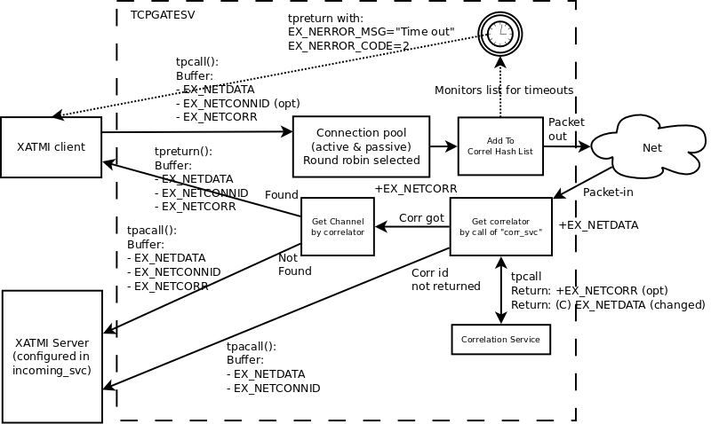
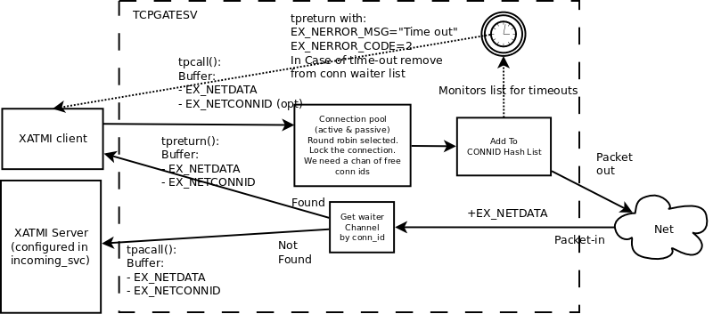
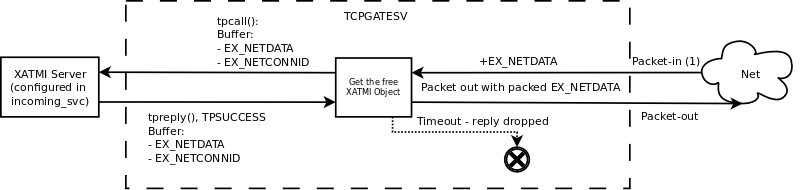
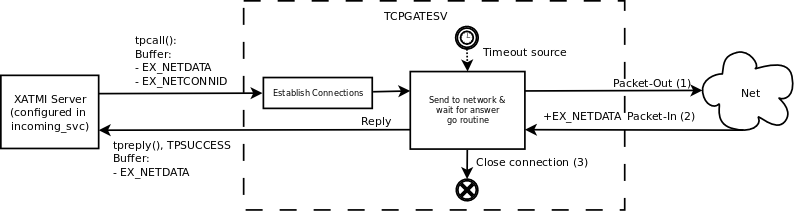
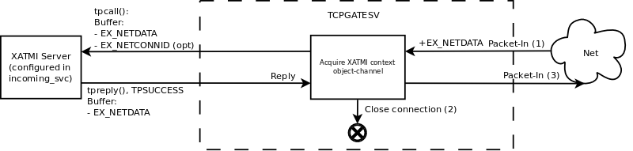

TCP Gateway Server User Guide
=============================
Madars Vitolins
v1.0, 2017-01:
	Initial draft
:doctype: book

== Introduction
This is user guide for Enduro/X TCP Gateway driver. The idea for this ATMI server
process is that user can easy create networked applications by using Enduro/X standard
package. The user does not have to deal with sockets library. The user program can
call in different modes "TCPGATESV" service which in turn will send the framed
packets to configured port:ip address. The gateway server supports different
protocol modes. List of them:

. Active mode - Our side establish connection

. Passive mode - We wait for incoming call

. Sync mode, request-reply mode - both for Active & Passive

. Persistent connections

. Asynchronous connectivity

. Timely established connections, which are being closed after inactivity period

. Multiple permanent asynchronous connections, with load balanced channel choosing

. Zero length messages for keeping TCP channel open

. Connection numbering from 1..N. The compiled message connection id includes timstamp

The next chapters will describe all the possible operational modes.

Driver opens number of connections. When doing outgoing message delivery the user can specify channel
id (by connection id) compiled or not compiled. If channel not specified, then random or round robin
channel will be used.

== Design ides

For round-robin mode available connection sharing channel can be used. Any open connection will submit
it's ID in channel it's handler. In case of async outgoing the connection thread will put it self back
in channel when message is sent to network. In case of sync mode, the thread can put it self in channel
list once it is made free. The marking connection as "idle" could be done by some kind of common
function.

== Connections: Active & passive
TCPGATESV in maintaining list of open connections wither dialed in our made the remote connection.
Enduro/X driver in active mode is attempting to keep the number of configuration
connections open if active. During the passive mode it limits the number of open
connections set by configuration flag.

*Configuration*: The passive the mode is activated by 'type' parameter. Value 'A' means active,
value 'P' means passive. The maximum number of connections are configured with
'max_connection' ini file parameter.

== Connection modes

There are two major group of connection modes: persistent and non persistent. them
persistent are ones when the connection is permanently open. And non  persistent is
when connection is open only during the request/reply pair.

== Persistent (Active & passive), async one or more outgoing channels
*configuration*: the async mode with persistent channel can be configured with following flags:

*req_reply* = false

=== EX -> NET With out correlation

In case if Enduro/X is calling the network with out correlation, then *TCPGATE*
service is called with *tpcall()*. The buffer contains following data:

Service *TCPGATE* receives in tpcall() mode following data:

Request buffer:

- Mandatory: *EX_NETDATA* - data to send

- Optional: *EX_NETCONNID* - optional connection id. The first youngest 24bits identifies
connection id, the oldest 40 bits identifies the exact timestamp for connection. If timestamp
is is 0, then the connection is taken from non-compiled connection list. If the oldest 40 bits
are non zero, then connection is taken from compiled list. If connection is not found, then service
will return application failure (with 'TPFAIL'). The UBF field *EX_NERROR_CODE* will 
be set to "9" indicating that there is no such connection, *EX_NERROR_MSG* will contain
exact message of the problem.

In case of error:

- Mandatory: *EX_NERROR_MSG* - "Connection not found"

- Mandatory: *EX_NERROR_CODE* - 9

image:pers_async_ex_to_net_wo_corr.png[caption="Figure 1: ", title="Persistent connection, asynchronous, no correlation, Enduro/X sends to Network", alt="Persistent connection, asynchronous, no correlation, Enduro/X sends to Network"]

Configuration:

- *req_reply* = false;

- *incoming_svc* = Set to Service.

=== NET -> EX With out correlation

In case if network is sending us a message, and we run in non 
correlated mode (*corr_svc* not set in ini). Then incoming message is filled 
following data, and is delivered in asynchronous way (tpacall(), with TPNOREPLY)
to the target ATMI server. The server receives following data:

- Mandatory: *EX_NETDATA* - received data from network

- Mandatory: *EX_NETCONNID* - Compiled connection id

Configuration: 

- *req_reply* = false;

- *incoming_svc* = Set to Service.

image:pers_async_net_to_ex_wo_corr.png[caption="Figure 2: ", title="Persistent connection, asynchronous, no correlation, Network sends to Enduro/X", alt="Persistent connection, asynchronous, no correlation, Network sends to Enduro/X"]

=== EX -> NET With correlation + NET -> EX With correlation

In case if Enduro/X is willing to send the message to Network with correlation, then
the UBF buffer must contain field *EX_NETCORR*. If the field is present the once the message
is submitted to network, the correlator will be registered in to hash list as waiting for answers.
When answer from network is received (or any other call), then message must be sent
to correlation service. Which will parse the message and will provide back the correlation number.
*NOTE*: The correlation service (*corr_svc* must be set in ini). The service have right to change
the UBF buffer *EX_NETDATA* value. So that for example the correlation service
have parsed the message and destination service do not have to parse it again. In case
if correlation is found in registered list of waiters, then response message is sent to
caller go routine (via channel). If the correlator number is not present in answer or
the the waiter is not found in the correlator hash list (for example caller timed out),
The message with all its content with *EX_NETDATA* (can be updated) and *EX_NETCONNID* and
*EX_NETCORR* (optional) will be sent to incoming service in async mode (*tpacall()* with 'TPNOREPLY')
to *incoming_svc* service configured in ini file.

Enduro/X-to-Net buffer:

- Mandatory: *EX_NETDATA* - data to send to network;

- Optional: *EX_NETCONNID* - Simple or compiled connection id of connection to send away data.

- Optional: *EX_NETCORR* - If provided by *incoming_svc* service;

Net-to-Enduro/X:

*tpreturn()* in case if found in correlation hash list or *tpacall()* if correlation is
not found in hash list:

- Mandatory: *EX_NETDATA* - data to send to network. Can be change by *incoming_svc*;

- Optional: *EX_NETCONNID* - Simple or compiled connection id;

- Optional: *EX_NETCORR* - If provided by *incoming_svc* service;

Configuration: 

- *req_reply* = 0

- *incoming_svc* = Set to Service.

- *corr_svc* = Set to Service.

- *req_reply_timeout* = Set to time-out number. Default 60 seconds.

- *scan_time* = This is time in milliseconds defining the period in 
which special thread in scanning the any open requests not receiving the responses.

== Persistent, sync one or more outgoing channels
This is synchronous mode, meaning that one request/replay pair is transferred over the
channel only one at time.

=== EX -> NET (correlated by connection id)
In this case Enduro/X synchronously invokes the *TCPGATE* service, but routine is waiting
for answer from the channel. The correlator in this case is connection id. So once some socket
receives the message, the list of waiters on connection ID are searched, if some entry is
found, then answer is made (data sent to waiter channel). Then connection is removed
from waiters list. In case if for incoming connection we cannot find connection id waiter,
then if defined, we send the message to *incoming_svc* if set

Buffer out (to Net):

- Mandatory: *EX_NETDATA* - data to send to network

- Optional: *EX_NETCONNID* - Simple or compiled connection id;

Reply buffer (or tpcall if connid waiter not found): 

- Mandatory: *EX_NETDATA* - data to send to network

- Mandatory: *EX_NETCONNID* - Compiled connection id;

Buffer in response in case of timeout:

- Mandatory: *EX_NERROR_MSG* - "Connection timeout"

- Mandatory: *EX_NERROR_CODE* - 8

Configuration: 

- *incoming_svc* = Optional, If set incoming messages will be sent sent in async (tpacall) 
mode to this service. Service can later figure out what to do with this message.

- *req_reply* = 1 (mode 1 - persistent mode request-reply, EX->NET)

- *req_reply_timeout* = Set to time-out number. Default 60 seconds.

- *scan_time* = This is time in milliseconds defining the period in 
which special thread in scanning the any open requests not receiving the responses.

=== NET -> EX (correlated by connection id)
In case of Network sending requests to XATMI in sync mode. We receive request, we
shall do the tpcall() synchronous. Wait for answer and send reply back to network.
In case of timeout, we do not send anything. The incoming call will get the free XATMI
context object (possibly wait for it). Timeout is controller by global Enduro/X configuration
flag *NDRX_TOUT*.

Net->Ex request buffer:

- Mandatory: *EX_NETDATA* - Data received from network

- Mandatory: *EX_NETCONNID* - Compiled connection id;

XATMI Response buffer:
- Mandatory: *EX_NETDATA* - data to send to network

Configuration: 

- *incoming_svc* = Mandatory, incoming requests will be targeted to this service.

- *req_reply* = 2 (mode 2 - persistent mode request-reply, NET->EX)

== Non persistent, sync (one connection per request/reply)

In case of non persistent processing, new connection is open on every request.

=== EX -> NET (correlated by connection id), only active mode
In this case tcp driver must be in active mode. I will open new connection for
every request. Once reply or timeout is received the connection is closed. The pool
of connections is not needed, but driver is keeping the track of max open connections,
if connections are over-reached, then reject message will be passed back to XATMI caller.

Ex->Net request buffer:

- Mandatory: *EX_NETDATA* - Data received from network

XATMI Response buffer:

- Mandatory: *EX_NETDATA* - Data received from network

or 

XATMI Response buffer:

- Mandatory: *EX_NERROR_MSG* - "Connection timeout"

- Mandatory: *EX_NERROR_CODE* - 8

or

- Mandatory: *EX_NERROR_MSG* - "Not connection (failed to connect)"

- Mandatory: *EX_NERROR_CODE* - 9

Configuration: 

- *type* = A (active)

- *req_reply* = 3 (mode 3 - non persistent mode, request-reply, EX->NET)

=== NET -> EX (correlated by connection id), only passive mode

In this case TCP Driver is running in passive mode. And is waiting for incoming
connections. When new connection is established, then new go routine is spawned.
Then the call is made to XATMI service. The time-out is controlled by XATMI service
invocation.

Ex->Net request buffer:

- Mandatory: *EX_NETDATA* - Data received from network

- Optional: *EX_NETCONNID* - Connection id really here not needed to be passed.
But can be added for informational reasons/debugging.

XATMI Response buffer:

- Mandatory: *EX_NETDATA* - Data received from XATMI sub-system (service reply)

Configuration: 

- *type* = P (passive)

- *req_reply* = 4 (mode 4 - non persistent mode, request-reply, NET->EX)

- *incoming_svc* = Mandatory, incoming requests will be targeted to this service.

== Connection state tracking

The *tcpgatesv* will send the state information about each connection - established or
not. Connection state data will be sent to *status_svc* service (if configured in ini).
following data is present in status request messages:

- EX_NETFLAGS - contains the event code. "C" - connected, "D" - disconnected

- EX_NETCONNID - contains the compiled connection id.

In case of server starting up and we are running in active mode (*type*='A') we shall
send for all *max_connection* the status that connection is closed.

The connection statuses are reported only in persistent connection mode (*req_reply*='0').

== Zero length keep-a-live messages
If parameter *zero_keepalive* is set to number greater than 0, then that is the number
of seconds for which to each open connection connection zero length message is sent.

== Error codes

In case of service returns failure, for outgoing messages, Enduro/X tcpgateway driver
will return error information in *EX_NERROR_MSG* and *EX_NERROR_CODE* fields:

*0* - Succeed, no error

*8* - Time-out (answer not received in time)

*9* - Connection not found

== Conclusions

For more details read on: http://www.endurox.org/dokuwiki

:numbered!:

[bibliography]
Additional documentation 
------------------------
This section lists additional related documents.

[bibliography]
.Resources
- [[[EX_DEVGUIDE]]] Enduro/X Internal Developer Guide.

////////////////////////////////////////////////////////////////
The index is normally left completely empty, it's contents being
generated automatically by the DocBook toolchain.
////////////////////////////////////////////////////////////////
