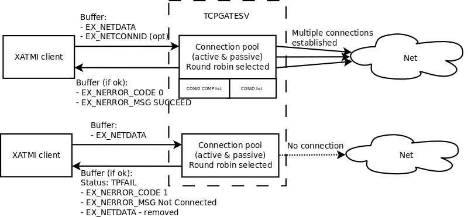
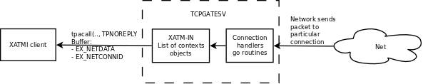

TCP Gateway Server User Guide
=============================
Madars Vitolins
v1.0, 2017-01:
	Initial draft
:doctype: book

== Introduction
This is user guide for Enduro/X TCP Gateway driver. The idea for this ATMI server
process is that user can easy create networked applications by using Enduro/X standard
package. The user does not have to deal with sockets library. The user program can
call in different modes "TCPGATESV" service which in turn will send the framed
packets to configured port:ip address. The gateway server supports different
protocol modes. List of them:

. Active mode - Our side establish connection

. Passive mode - We wait for incoming call

. Sync mode, request-reply mode - both for Active & Passive

. Persistent connections

. Asynchronous connectivity

. Timely established connections, which are being closed after inactivity period

. Multiple permanent asynchronous connections, with load balanced channel choosing

. Zero length messages for keeping TCP channel open

. Connection numbering from 1..N. The compiled message connection id includes timstamp

The next chapters will describe all the possible operational modes.

Driver opens number of connections. When doing outgoing message delivery the user can specify channel
id (by connection id) compiled or not compiled. If channel not specified, then random or round robin
channel will be used.

== Connections: Active & passive
TCPGATESV in mainting list of open connections wither dialed in our made the remote connection.
Enduro/X driver in active mode is attempting to keep the number of configuration
connections open if active. During the passive mode it limits the number of open
connections set by configuration flag.

*Configuration*: The passive the mode is activated by 'type' parameter. Value 'A' means active,
value 'P' means passive. The maximum number of connections are configured with
'max_connection' ini file parameter.

== Connection modes

There are two major group of connection modes: persistent and non persistent. them
persistent are ones when the connection is permanently open. And non  persistent is
when connection is open only during the request/reply pair.

=== Persistent (Active & passive), async one or more outgoing channels
*configuration*: the async mode with persistent channel can be configured with following flags:

'req_reply' = false

==== EX -> NET With out correlation

In case if Enduro/X is calling the network with out correlation, then *TCPGATE*
service is called with *tpcall()*. The buffer contains following data:

Service *TCPGATE* receives in tpcall() mode following data:

- Mandatory: *EX_NETDATA* - data to send

- Optional: *EX_NETCONNID* - optional connection id. The first youngest 24bits identifies
connection id, the oldest 40 bits identifies the exact timestamp for connection. If timestamp
is is 0, then the connection is taken from non-compiled connection list. If the oldest 40 bits
are non zero, then connection is taken from compiled list. If connection is not found, then service
will return application failure (with 'TPFAIL'). The UBF field *EX_NERROR_CODE* will 
be set to "1" indicating that there is no such connection, *EX_NERROR_MSG* will contain
exact message of the problem.

==== NET -> EX With out correlation

In case if network is sending us a message, and we run in non 
correlated mode (*corr_svc* not set in ini). Then incoming message is filled 
following data, and is delivered in asynchronous way (tpacall(), with TPNOREPLY)
to the target ATMI server. The server receives following data:

- Mandatory: *EX_NETDATA* - received data from network

- Mandatory: *EX_NETCONNID* - Compiled connection id

==== EX -> NET With correlation

In case if Enduro/X is willing to send the message to Network with correlation, then
the UBF buffer must contain field *EX_NETCORR*. If the field is present the once the message
is submitted to network, the correlator will be registered in to hash list as waiting for answers.

==== NET -> EX With correlation
..
=== Persistent, sync one or more outgoing channels
..
==== EX -> NET (correlated by connection id)
..
==== NET -> EX (correlated by connection id)

=== Non persistent (one connection per request/reply)
..
==== EX -> NET (correlated by connection id), only active mode
..
==== NET -> EX (correlated by connection id), only passive mode

== Connection state tracking

The *tcpgatesv* will send the state information about each connection - established or
not. Connection state data will be sent to *status_svc* service (if configured in ini).
following data is present in status request messages:

- EX_NETFLAGS - contains the event code. "C" - connected, "D" - disconnected

- EX_NETCONNID - contains the compiled connection id.

In case of server starting up and we are running in active mode (*type*='A') we shall
send for all *max_connection* the status that connection is closed.

The connection statuses are reported only only in persistent connection mode (*req_reply*='0').

== Reply waiting timeout

The flag .... will set the number of seconds how long we wait for reply.

== Zero length keep-a-live messages
If parameter *zero_keepalive* is set to number greater than 0, then that is the number
of seconds for which to each open connection connection zero length message is sent.

== Error codes

In case of service returns failure, for outgoing messages, Enduro/X tcpgateway driver
will return error information in *EX_NERROR_MSG* and *EX_NERROR_CODE* fields:

*0* - Succeed, no error

*1* - Connection not found

== Conclusions

For more details read on: http://www.endurox.org/dokuwiki
The base Enduro/X documentation is valid, as Enduro/X ASG is wrapping in the C
libraries.

:numbered!:

[bibliography]
Additional documentation 
------------------------
This section lists additional related documents.

[bibliography]
.Resources
- [[[EX_DEVGUIDE]]] Enduro/X Internal Developer Guide.

////////////////////////////////////////////////////////////////
The index is normally left completely empty, it's contents being
generated automatically by the DocBook toolchain.
////////////////////////////////////////////////////////////////
